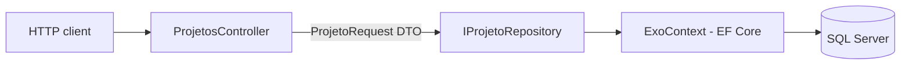

# Exo Web API


A REST API to manage projects (create, read, update and delete), built with **ASP.NET Core 8**, **Entity Framework Core** and **SQL Server**.

This project started as a course exercise. I refactored it to follow the practices I use in real systems: layered architecture, configuration outside the code, automated tests, Docker and continuous integration.

## Architecture



- **Controller**: handles HTTP, validation and status codes. It does not know about the database.
- **Repository**: the only layer that talks to EF Core. The controller depends on the interface, so the data access can be replaced or tested in isolation.
- **DTO** (`ProjetoRequest`): the request body is separate from the entity, so a client can never set the `Id`.

## Endpoints

| Method | Route | Description | Responses |
|---|---|---|---|
| GET | `/api/projetos` | List all projects | 200 |
| GET | `/api/projetos/{id}` | Get one project | 200, 404 |
| POST | `/api/projetos` | Create a project | 201 (with `Location` header), 400 |
| PUT | `/api/projetos/{id}` | Update a project | 204, 400, 404 |
| DELETE | `/api/projetos/{id}` | Delete a project | 204, 404 |
| GET | `/health` | Health check | 200 |

Example request body:

```json
{
  "nomeDoProjeto": "Customer Portal",
  "area": "Backend",
  "status": true
}
```

## How to run

### With Docker (recommended)

You only need Docker installed. This starts SQL Server and the API together:

```bash
cp .env.example .env   # optional: set your own local password
docker compose up --build
```

Then open the Swagger UI at http://localhost:8080/swagger.

### Locally with the .NET SDK

1. Install the [.NET 8 SDK](https://dotnet.microsoft.com/download) and have a SQL Server instance running.
2. Set your connection string in `src/Exo.WebApi/appsettings.json`, or with an environment variable:
   ```bash
   export ConnectionStrings__DefaultConnection="Server=localhost;Database=ExoApi;Trusted_Connection=True;TrustServerCertificate=True"
   ```
3. Run the API:
   ```bash
   dotnet run --project src/Exo.WebApi
   ```

In the `Development` environment the database schema is created automatically on startup.

## Tests

```bash
dotnet test
```

- **Unit tests** check the repository with the EF Core in-memory provider.
- **Integration tests** start the whole API in memory with `WebApplicationFactory` and send real HTTP requests. They cover success paths, validation errors (400) and missing resources (404).

The CI pipeline (GitHub Actions) builds the solution, runs all tests and builds the Docker image on every push and pull request.

## Project structure

```
├── src/Exo.WebApi/            # API project
│   ├── Contexts/              # EF Core DbContext and table mapping
│   ├── Controllers/           # HTTP endpoints
│   ├── Dtos/                  # Request models with validation
│   ├── Models/                # Entities
│   └── Repositories/          # Data access (interface + implementation)
├── tests/Exo.WebApi.Tests/    # Unit and integration tests
├── Dockerfile                 # Multi-stage build, runs as non-root
├── docker-compose.yml         # API + SQL Server for local development
└── .github/workflows/ci.yml   # Build, test and Docker build
```

## Next steps

- Replace `EnsureCreated` with EF Core migrations to version the database schema
- Add pagination and filters to the list endpoint
- Add authentication (JWT)

## Author

**João Gabriel Peloso** · [LinkedIn](https://www.linkedin.com/in/jo%C3%A3o-gabriel-peloso-610786173/)
